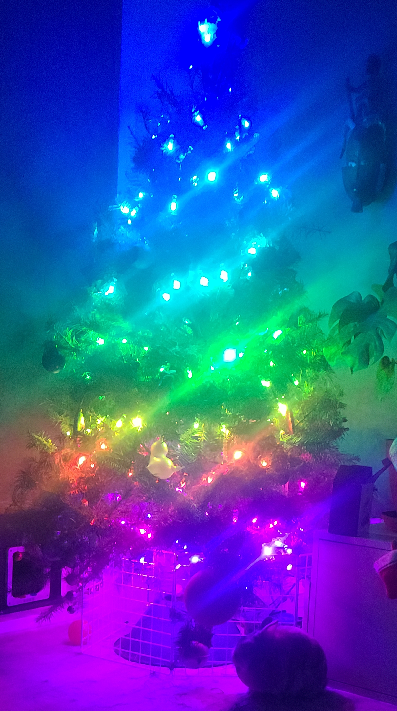

# react-christmas-tree

React christmas tree is the peak of holiday cheer inducing technology. Featuring a 
7 Inch LCD Touch screen and a genuine Douglas Fir tree, you can't escape the Christmas 
spirit of this project.

Bunny for scale.

# Controller

Although the tree can be controlled from any local web browser, the project features its own touch screen. This 7 inch touchscreen is powered by a Raspberry Pi 4 and features a 3D printed PLA holder. Using PM2, the React Server is daemonized here for easy updates over SHH from the main dev machine.

# Setup

1 ) Clone Repo

2 ) Run 'yarn' to install dependencies

3 ) run 'yarn start' to start server in development mode.

My preference for running servers is to Daemonize them with <a href="https://pm2.keymetrics.io/">pm2</a> to have them start on boot and also keep them open after disconnecting from SSH.

## To Use PM2

1) npm install pm2 -g
2) pm2 startup
3) pm2 start "yarn start" --name "xmas-tree"
4) pm2 save

